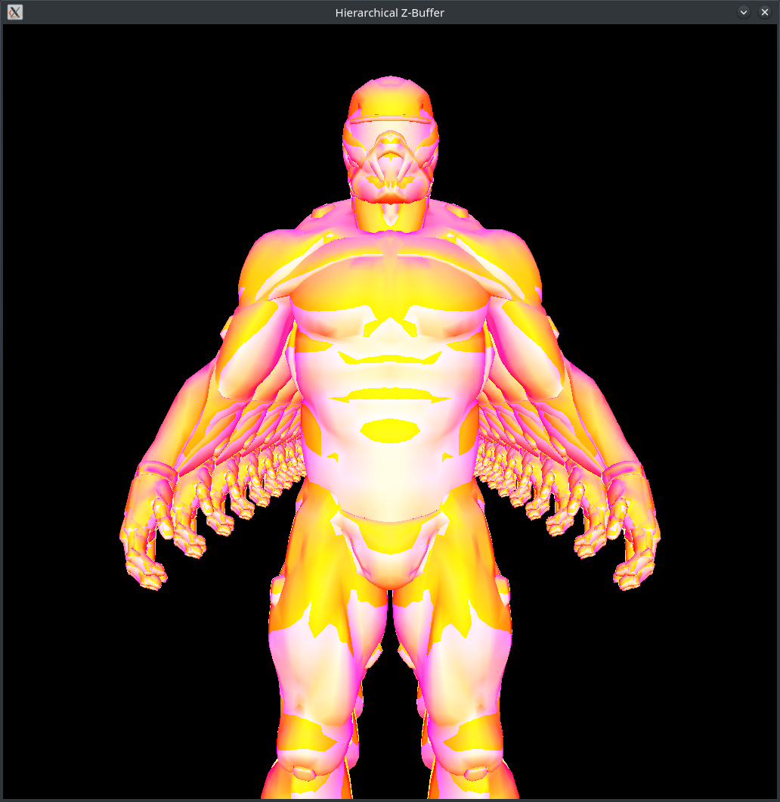

`层次Z-Buffer+场景八叉树`
========================================
## 简介
    本项目是一个软光栅渲染器，一共实现了四个版本的zbuffer算法
    1.最普通的zbuffer算法
    2.扫描线zbuffer算法
    3.层次zbuffer算法
    4.层自zbuffer+场景八叉树算法
## 配置
    使用cmake进行项目管理，windows10和linux(majaro)都可以编译成功并运行
    c++17
    cmake v3.17 or newer
## 第三方依赖库
    1.SDL2
    2.glm
    3.tiny_obj_loader
## 注意
    读取的obj文件除了顶点坐标，还必须要有法向量和纹理坐标，不然无法正常运行
## 运行示例

    